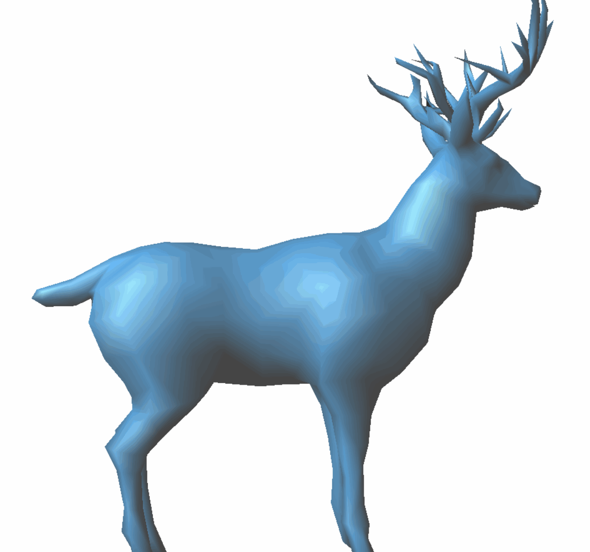
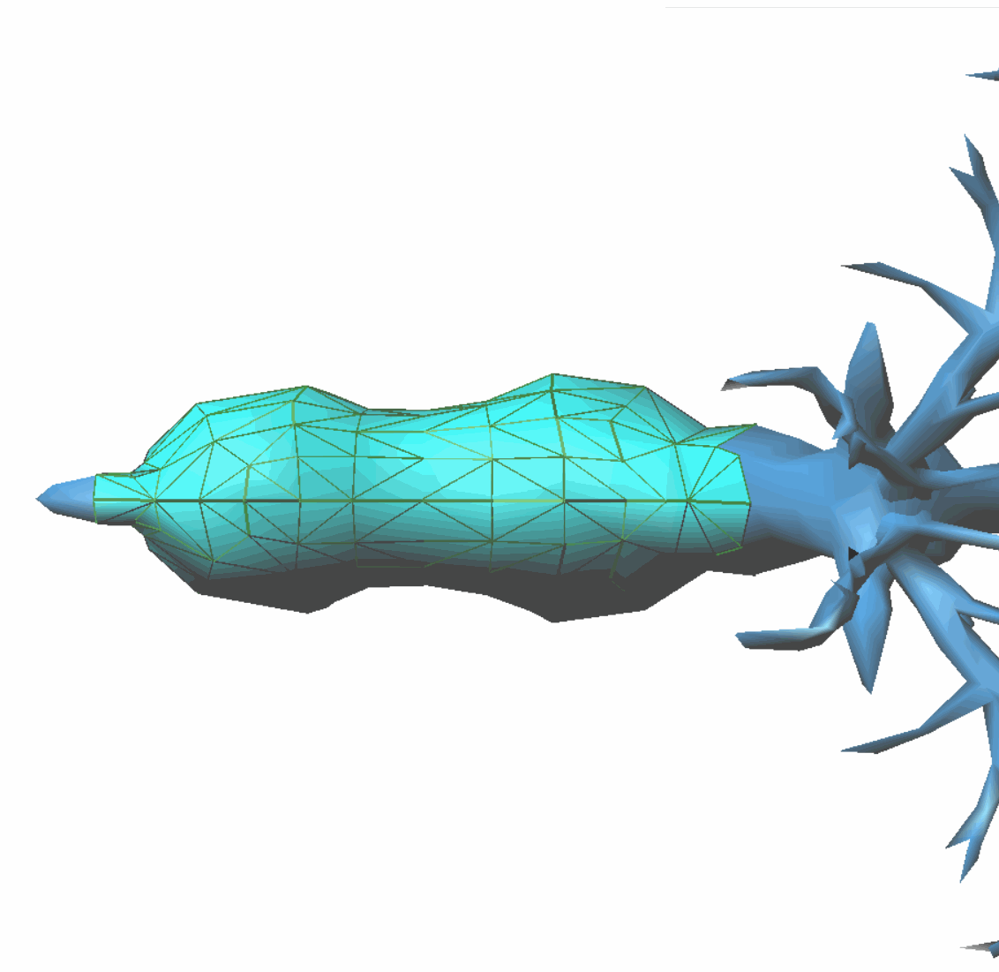
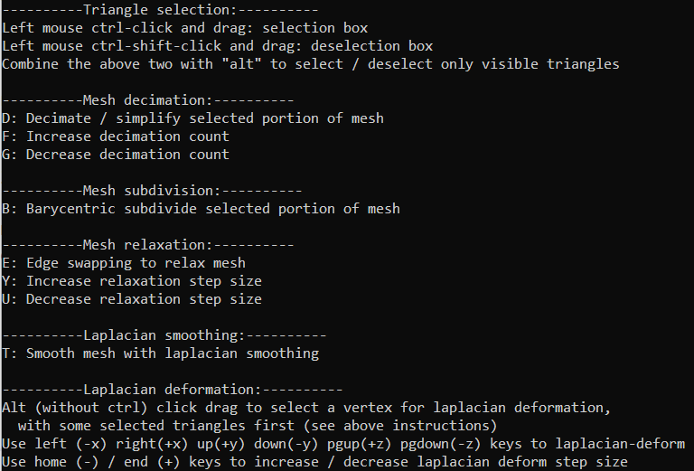

# 3242 Modelling Project

This is my modelling project solution to CS3242 (3D Modelling and Animation).

The project came with several universal basic, under-the-hood requirements, such as being able to implement edge traversal algorithms using Trist structures.

The "final boss" project was however freeform; I went all out and had great fun implementing the following features:

---

### Triangle Selection / Deselection

Seems rather straightforward :slightly_smiling_face:

As the project necessitated an older OpenGL version with not-as-robust raycasting functionalities,
I opted to do the "math" manually.

Namely,
- Compute the inverse matrix transformation to bring mesh vertices into viewport space
- Use the Cohen-Sutherland clipping algorithm to clip vertices outside

### Laplacian Deformation

:star: :star:

Laplacian deformation is a constrained least squares optimization problem not covered in CS3242 but I learnt in CS5240 (Theoratical Foundations of Multimedia).

The optimization objective is to **preserve the shape** of the deformed mesh as much as possible, whilst being constrained by translations of certain vertices (in this case the purple dot you see the gif!).
I implemented connected component checks as well to make this more performant.

### Mesh Decimation

"Straightforward"! (lots of under the hood checks using the trist structure)

### Mesh Subdivision, Laplacian Smoothing

Also "straightforward".

### Edge Relaxation

The edge relaxation here aims to improve the **quality** of the mesh, through edge swapping.

Observe how "highly angled / obtuse" triangle's edges are swapped!

### Running Instructions

Instructions are included in the CLI. Several `obj` files are also provided.

:star: Specify the `.obj` file path as an absolute file path.

